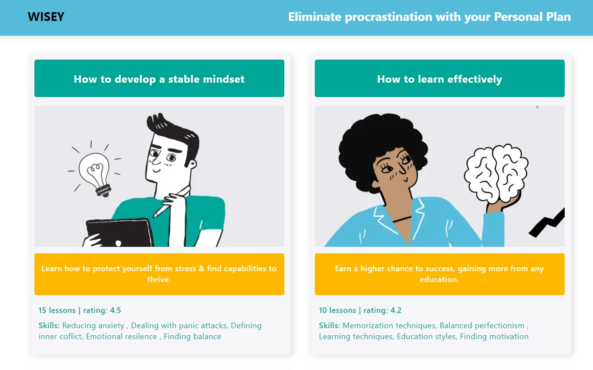
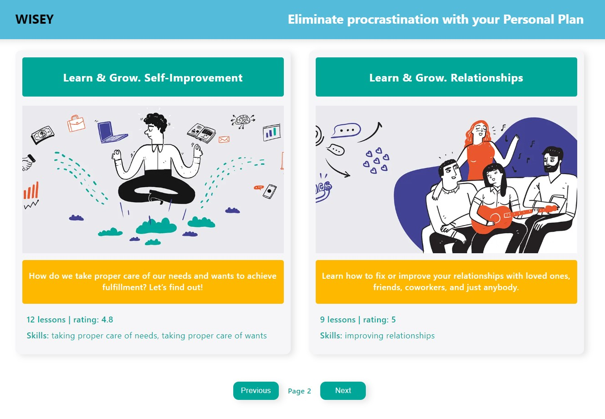
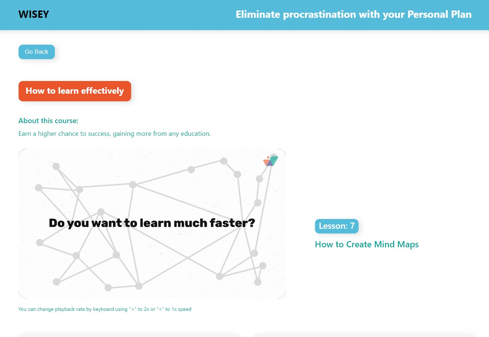
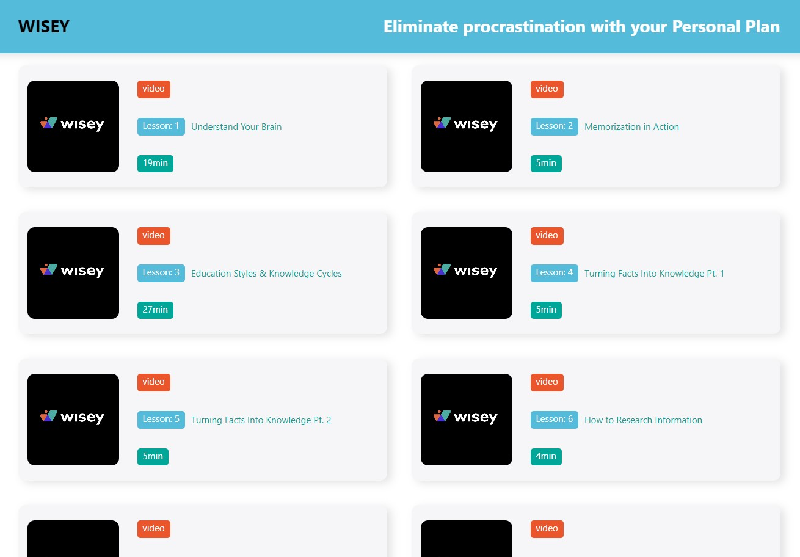
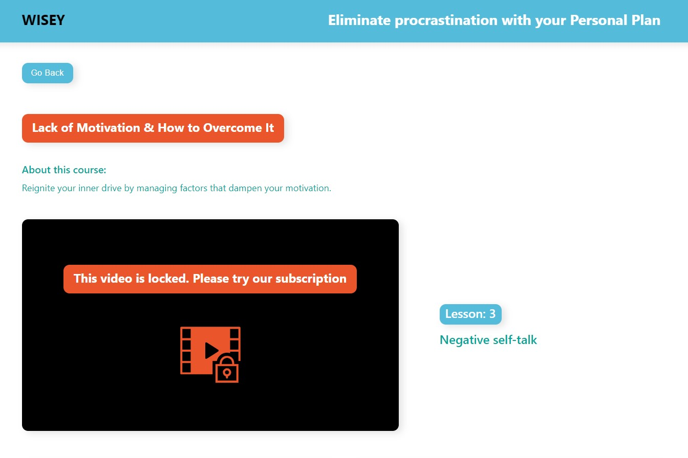
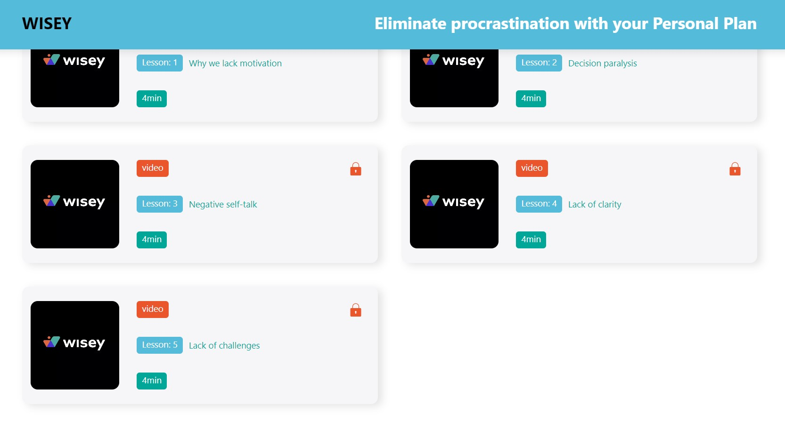
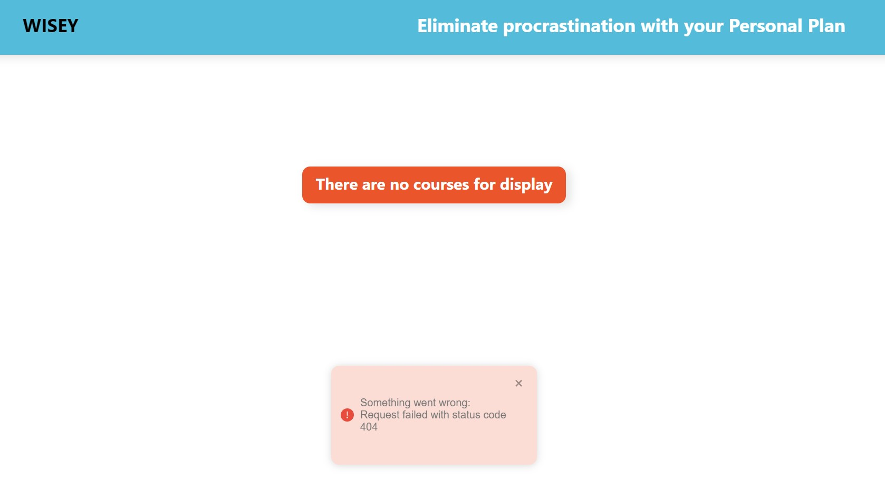
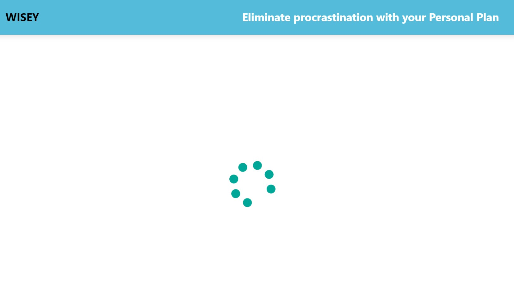
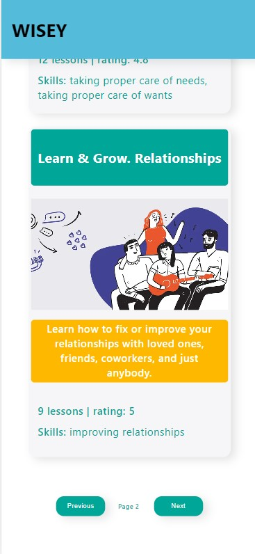
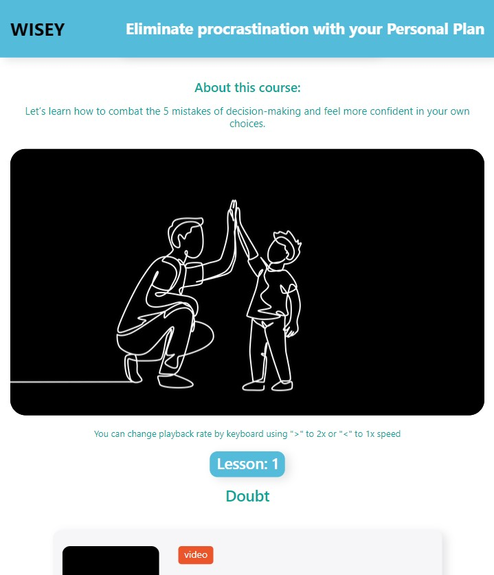

# Education App

## Technical Features

This App is made with React. For routing is used React Router.
Responsive/Adaptive design (three breakpoints: 320px, 768px, 1280px)

## Description

WISEY Education App is an application for learning different courses.

Home page contains all courses with detailed information about each of them. When user hovers over a course, a muted video about this course will be displayed. For user's comfort has been added pagination, on each page will be displayed information about 10 courses.

User can choose any course, he will be redirected to a page with detailed information about this course and lessons in it, the progress about current lesson will be saved locally. After navigating the site, when user switches to this course, to user will be shown the current lesson and the video will start from the moment he finished watching.

For user's convenience, the ability to change video playback speed from the keyboard is implemented.

Home page



Home Page Pagination



Home Page Hovered


Course Details Page



Course Details Page



Locked Video



Locked Lessons



Not Found Page


Error



Loading spinner



Home Page Mobile



Course Details Page Mobile


Home Page Tablet


Course Details Page Tablet




## Deploy

[Link](https://olgamykhailova.github.io/education-app)

## Project setup

```
npm install
npm start
```