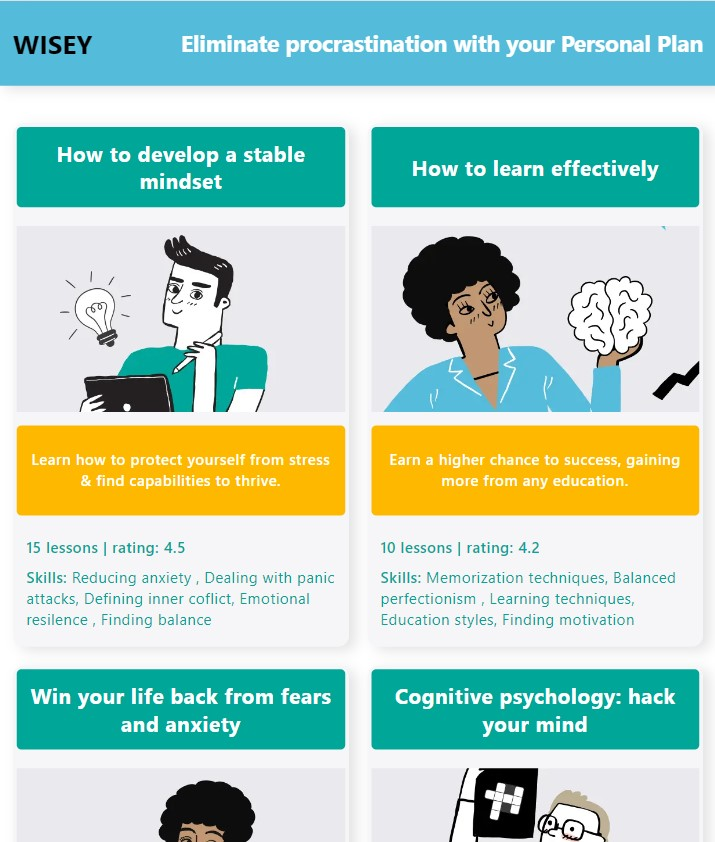

# Education App

## Technical Features

This App is made with React. For routing is used React Router.
Responsive/Adaptive design (three breakponts: 320px, 768px, 1280px)

## Description

Wise Education App is an application for learning different courses.

Home page


Home Page Pagination


Home Page Hovered


Course Details Page


Course Details Page


Not Found Page


Error


Loading spinner


Home Page Mobile


Course Details Page Mobile


Home Page Tablet



Course Details Page Tablet


## Deploy

[Link](https://olgamykhailova.github.io/education-app)

## Project setup

```
npm install
npm start
```